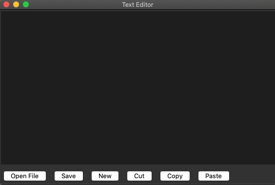

## Text Editor

This is a basic text editor application built using Python and Tkinter. It provides essential functionalities for creating, opening, editing, and saving text files.



## Features

- Create new text documents
- Open existing text files
- Save text files
- Cut, copy, and paste text
- Simple and intuitive user interface

## Requirements

- Python 3.x
- Tkinter (usually comes pre-installed with Python)

## Installation

1. Ensure you have Python installed on your system.
2. No additional installation is required as this application uses built-in Python libraries.

## Usage

1. Run the script using Python:
   ```
   python text_editor.py
   ```
2. The text editor window will open.
3. Use the buttons at the bottom of the window to perform various operations:
   - "New": Create a new blank document
   - "Open File": Open an existing text file
   - "Save": Save the current document
   - "Cut": Cut selected text
   - "Copy": Copy selected text
   - "Paste": Paste text from clipboard

## Code Structure

- The main window is created using `tk.Tk()`
- Text editing area is implemented using `tk.Text` widget
- File operations (open, save) use `tkinter.filedialog`
- Cut, copy, and paste operations use the system's clipboard through Tkinter events

## Contributing

Feel free to fork this project and submit pull requests with improvements or bug fixes.

## License

This project is open source and available under the [MIT License](https://opensource.org/licenses/MIT).
